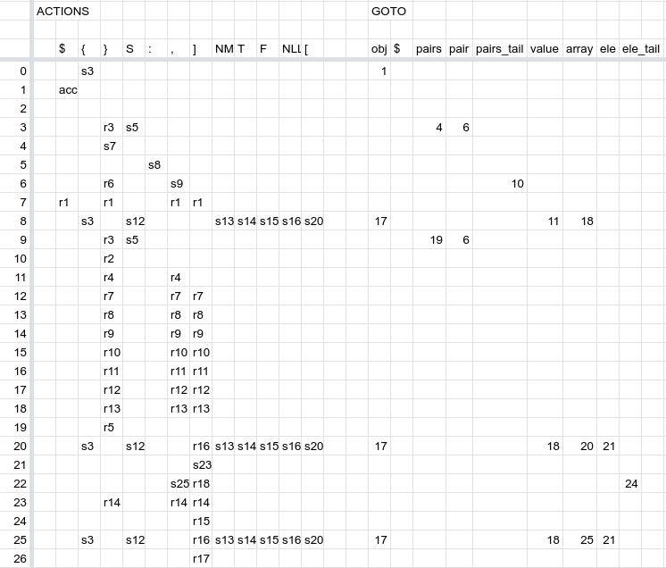

# Rust JSON LR(0) Parser

## About

In order to put to use everything I read about in [Compilers: Principles, Techniques, and Tools](https://suif.stanford.edu/dragonbook/) to use, I decided to implement an LR parser as is described in Chapter 4 of the book. 

Parsing is a large chunk of the textbook, and it goes into great detail on the theory and rationale behind the different approaches. The chapter dedicated to parsing is much significantly larger than the others around it, and having a project to show my understanding of the material instead of dumping a large list of exercises done seemed much better to do. 

The textbook is broken into 12 chapters, and the book describes how a usual undergrad course would read 1-6. I read 1-6 and implemented this project to serve as a comprehensive demonstration of understanding.

This parser uses the LR(0) recursive ascent approach to parse and validate JSON. 

JSON served as a good specification to target due to its small grammar and widespread use. Unlike targeting a programming language, the specification was small enough to fully implement and check for correctness, whereas other programming languages I would need to target only a subset to compile in the essence of time. Intermediate code generation will not come into play here, although I found that section very interesting to read.

Note: this does not handle unicode properly.

I needed to include a library for handling floats as not NaN so that they could be hashable in maps.

## Parse Table

We begin with the cleanly-written grammar [here,](https://blog.reverberate.org/2013/09/ll-and-lr-in-context-why-parsing-tools.html) and use it to generate the LR parse tables.

```
object → '{' pairs '}'

pairs      → pair pairs_tail | ε
pair       → STRING ':' value
pairs_tail → ',' pairs | ε

value → STRING | NUMBER | 'true' | 'false' | 'null' | object | array
array → '[' elements ']'

elements      → value elements_tail | ε
elements_tail → ',' elements | ε
```

We add a start symbol and production `S -> object` and use it as the first state, placing the cursor at the first position. (Single quotes are omitted for space.)

```
S0: S -> • object $
         • { pairs }
```

We see that there is a nonterminal left that has not been followed through on. We make a new state `S1` for this item set and add it to the GOTO table, no shift action. (Double arrows are used to show state transitions in the states themselves, not part of the table.)

```
S0:  S -> • object $  => S1
          • { pairs }

S1:  S -> object • $
```

```
S|    ACTION    |       GOTO                   
 |              | o  
------------------------------
0|              | 1  
1|              |
2|              |
3|              |
4|              |
...     
```

From `S1`, we see there's nowhere to go but advancing the cursor to the end of input (`S2`), with an ACCEPT action thereafter. All valid JSON ends at the end of an object followed by the end of input.

```
S0:  S -> • object $  => S1
          • { pairs } 

S1:  S -> object • $  => S2

S2:  S -> object $ •  => ACCEPT
```

```
S|    ACTION    |       GOTO                   
 | $            | o $ 
------------------------------
0|              | 1  
1|              |   2
2| a            |
3|              |
4|              |
...     
```

Back in `S0`, if the terminal `{` is found right after the cursor, we go to a new state with the cursor moved to the right (`S3`) and see what can follow from there, taking the closure as before. Since `{` is terminal, we add a shift action from `S0 -> S3` on `{`.

```
S0:  S -> • object $  => S1
          • { pairs } => S3

S1:  S -> object • $  => S2

S2:  S -> object $ •  => ACCEPT

S3:  S -> { • pairs }
     pairs -> • pair pairs_tail 
     pairs -> • STRING : value pairs_tail
     pairs -> •
```

```
S|    ACTION    |       GOTO                   
 | $ {          | o $ 
------------------------------
0|   s3         | 1  
1|              |   2
2| a            |
3|              |
4|              |
...     
```

Next we will follow the process, over and over, until we reach our finished parse table as follows: (I moved to a graphical sheets program for this, screenshot below.)

Productions labelled for reduce:

```
1:  object → '{' pairs '}'

2:  pairs      → pair pairs_tail 
3:             | ε

4:  pair       → STRING ':' value

5:  pairs_tail → ',' pairs 
6:             | ε

7:  value → STRING 
8:        | NUMBER 
9:        | 'true' 
10:       | 'false' 
11:       | 'null' 
12:       | object 
13:       | array

14: array → '[' elements ']'

15: elements      → value elements_tail 
16:               | ε
17: elements_tail → ',' elements 
18:               | ε
```


States to generate the table:

```
S0:  S -> • object $  => S1
        | • { pairs } => S3

S1:  S -> object • $  => S2

S2:  S -> object $ •  => ACCEPT

S3:  object -> { • pairs }      => S4 (GOTO)
     pairs -> • pair pairs_tail => S6
            | •                 => S4
     pair  -> • STRING : value  => S5
            

S4:  object -> { pairs • }      => S7

S5:  pair -> STRING • : value   => S8

S6:  pairs -> pair • pairs_tail => S10
     pairs_tail -> • ',' pairs  => S9
     pairs_tail -> •            => S7

S7:  object -> { pairs } •

S8:  pair -> STRING : • value  => S11
     value -> STRING           => S12
            | NUMBER           => S13
            | 'true'           => S14
            | 'false'          => S15
            | 'null'           => S16
            | object           => S17
            | array            => S18

S9:  pairs_tail -> ',' • pairs  => S19
     pairs -> • pair pairs_tail => S6
            | •                 => S4
     pair  -> • STRING : value  => S5
-
S10: pairs -> pair pairs_tail •
-
S11: pair -> STRING : value • 

S12: value -> STRING •

S13: value -> NUMBER •

S14: value -> 'true' •

S15: value -> 'false' •

S16: value -> 'null' •

S17: value -> object •

S18: value -> array •

S19: pairs_tail -> ',' pairs •

S20: array -> [ • elements ]
     elements -> • value elements_tail
               | • [ elements ]
               | •
     value -> STRING 
            | NUMBER 
            | 'true' 
            | 'false' 
            | 'null' 
            | object 
            | array 
     object -> • { pairs }

S21: array -> [ elements • ]

S22: elements -> value • element_tail 
     elements_tail -> • , elements
                    | •

S23: array -> [ elements ] •

S24: elements -> value elements_tail •

S25: elements_tail -> , • elements
     elements -> • value elements_tail
               | • [ elements ]
               | •
     value -> STRING 
            | NUMBER 
            | 'true' 
            | 'false' 
            | 'null' 
            | object 
            | array 
     object -> • { pairs }

S26: elements_tail -> , elements •
```

Differences in final: State 2 was actually unnecessary.



## References Used

* [Compilers: Principles, Techniques, and Tools](https://suif.stanford.edu/dragonbook/), primarily chapters 3 (lexer) and 4 (parser).
* [RFC 8259](https://www.ietf.org/rfc/rfc8259.txt), the JSON standard.
* [RFC 4234](https://www.ietf.org/rfc/rfc4234.txt), the Augmented BNF standard.
* [The Rust Book](https://doc.rust-lang.org/book/), standard documentation for the language I implemented the parser in.
* [Learn Rust With Entirely Too Many Linked Lists](https://rust-unofficial.github.io/too-many-lists/), an introduction to data structures that feel cumbersome to use in Rust that feel easier in other languages.
* [LL and LR in Context](https://blog.reverberate.org/2013/09/ll-and-lr-in-context-why-parsing-tools.html), an interesting article that had a much cleaner translation of the ABNF notation from the JSON RFC tham my first attempt.

## Building

`cargo build` to create the executable.

## Usage